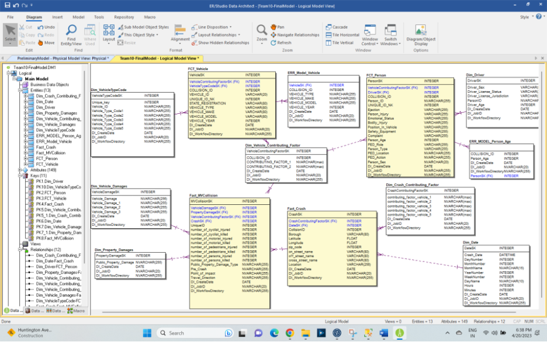
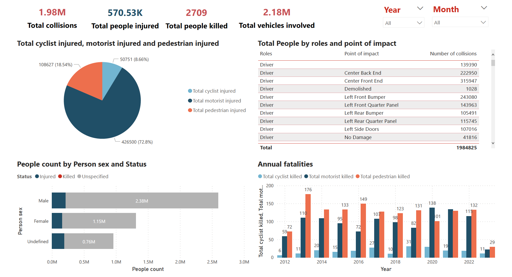
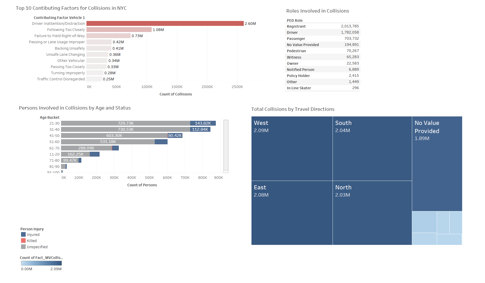
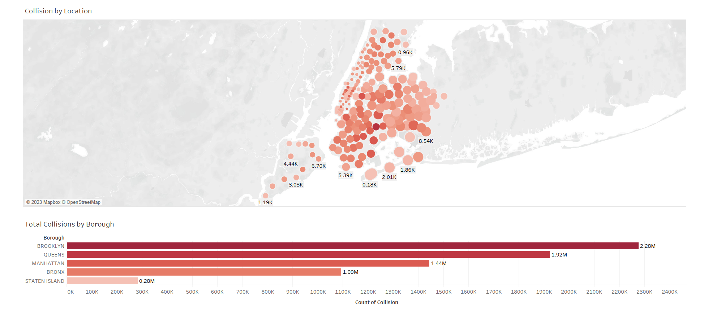

# NYC-Vehicle-Collisions-Data-Warehourse

## About the dataset

The dataset used is NYPD's Motor Vehicle Collisions, which is provided by the NYC Open Data repository. This dataset was created for the Vision Zero initiative, which is a multi-national road traffic safety project that aims at decreasing the number of fatalities or serious injuries involving road traffic.

The dataset consist of information about all collisions in NYC from July 2012 to April 2018. It contains information about date, location, cause of the accident, number and type of injured, and killed road users. The dataset consists of 1.25M rows, 29 columns, resulting in a file size of 275MB.

## Project Motivation

Each of the group members is an active driver, cyclist and pedestrian. The problem of traffic accidents is close to our hearts. We have decided to explore the collision data to see if there were any underlying trends and relationships that could explain the number of accidents occurring. As a consequence, it might help responsible institutions to find out what could be done to make cities safer.

Moreover, The NYPD's Motor Vehicle Collisions dataset is large and covers a long range of time. Data contains wide range of information (time, location, zipcode, type of victim, cause of accident etc). As a consequence, we have found this dataset very attractive and reliable. We believe that the theses made on the basis of these data, can be considered as reasonable.

## Goal

When planning and implementing this project, we were very much inspired by the articles created by Ben Wellington. Using narration, we wanted to lead the reader through the process of finding underlying trends and relationships. For this reason, our site consists of a short article combined with a group of interactive visualizations. The visualisation where carefully selected. The goal was to give the user a general overview and encourage him, by suggesting different hypotheses, to go into more details, using interactive visualisations. We wanted the graphs to be understandable, intuitive and aesthetic. We strongly believe that the user will be willing to analyse the data even deeper, than the narration suggests. We have decided that the visualisation process should be accompanied by three main questions: Where, when and why?

Where are the most dangerous spots?
When do most collisions occur?
What are the most frequent causes?

## Data Cleaning
•	We replaced null values with “No Value Provided” in all the Dimensions keeping -99 as SK.
•	We observed discrepancies in vehicle occupants, for example 2000 occupants. Since most of the data was wrong, we did not proceed with correcting/replacing.
•	Redundant directions in Travel_Direction were changed to a homogeneous format.
•	Vehicle_Year with nulls and values less than 1900 or greater than 2023 with 9999.
•	Respective excel sheets are maintained for vehicle_type_code, vehicle_make, vehicle_model, vehicle_year with corrected data since these have large number of discrepancies. We implemented a lookup with these excel files instead of tReplace because it took a lot of memory on our systems.
•	Contributing factors which had numbers and spelling errors were replaced with “Unknown” or the correct spelling.
•	Driver_License_Jurisdiction format was maintained with a two-character format and invalid inputs such as special characters for example “-“, “PA’” etc were corrected or replaced with “Invalid Input”.
•	Person_Age with negative/large values have been replaced with 0.
•	It was observed that certain Collision_ID(s) in stg_NYC_MV_Collision_Person was not present in  stg_NYC_MV_Collision_Vehicle but present in stg_NYC_MV_Collision_Crashes. So we have assumed that there is Vehicle data missing for these Person_IDs 

#### Assumptions
•	Contributing Factor in Vehicle is assumed to be the correct version since we observed most of these values matching in both person and vehicle table, but for some collision IDs there were empty values in only person table but not in vehicle table.

### Staging Folder

1. Data Profiling with Alteryx
2. Staging Layer - staging data on BigQuery using Talend
3. Preliminary dimensional model with source to target (S2T) mapping

### Model Folder

1. Documentation of data cleaning, observations, and assumptions
2. Integration Layer - cleaning and pushing data to final dimensional model on SQL Server

## Dimensional Model

 

	  
    <em>Vehicle Collisions Data Model</em>

## Visualisations
Using PowerBI and Tableau

 

	  
    <em>Visualisation - PowerBI</em>

 

	  
    <em>Visualisation - Tableau</em>

 

	  
    <em>Visualisation - Tableau</em>

